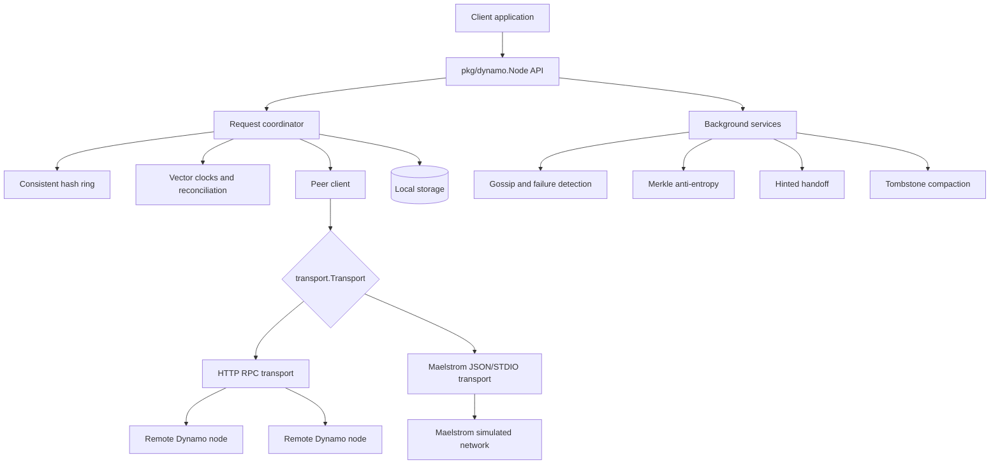
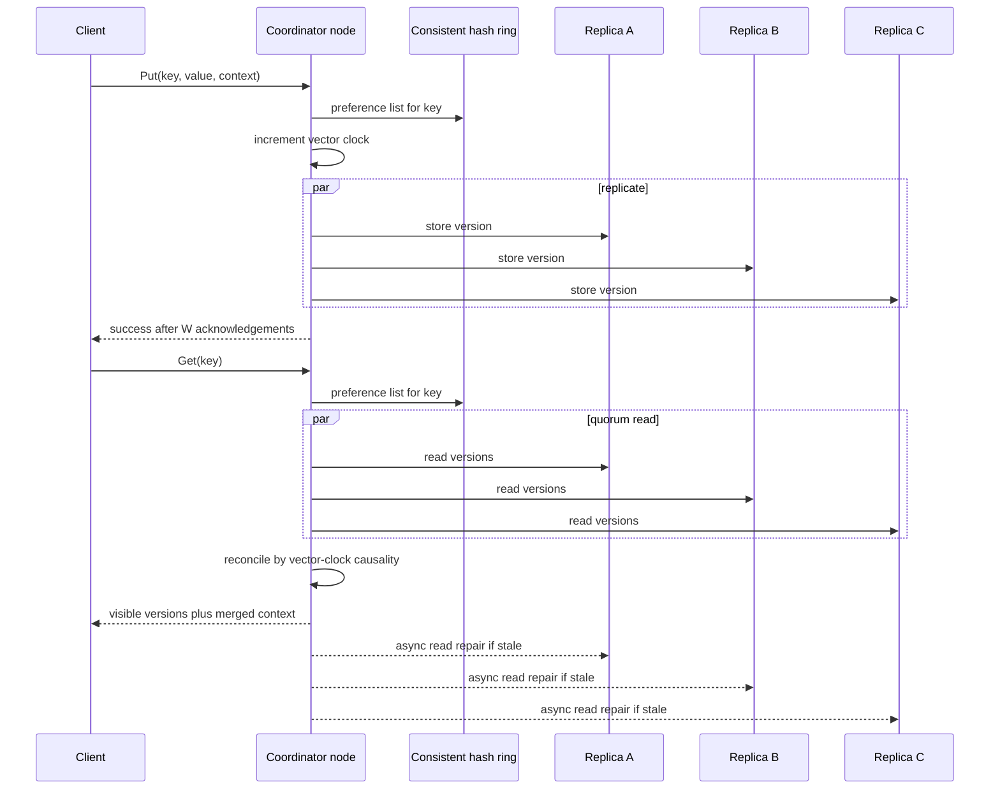
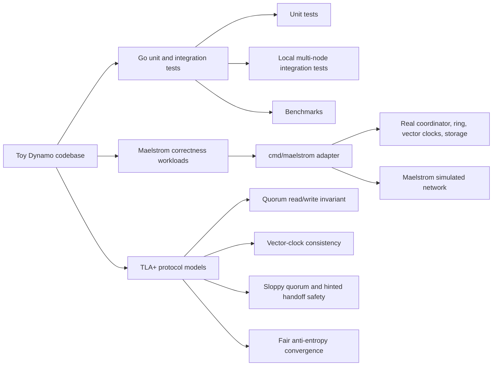
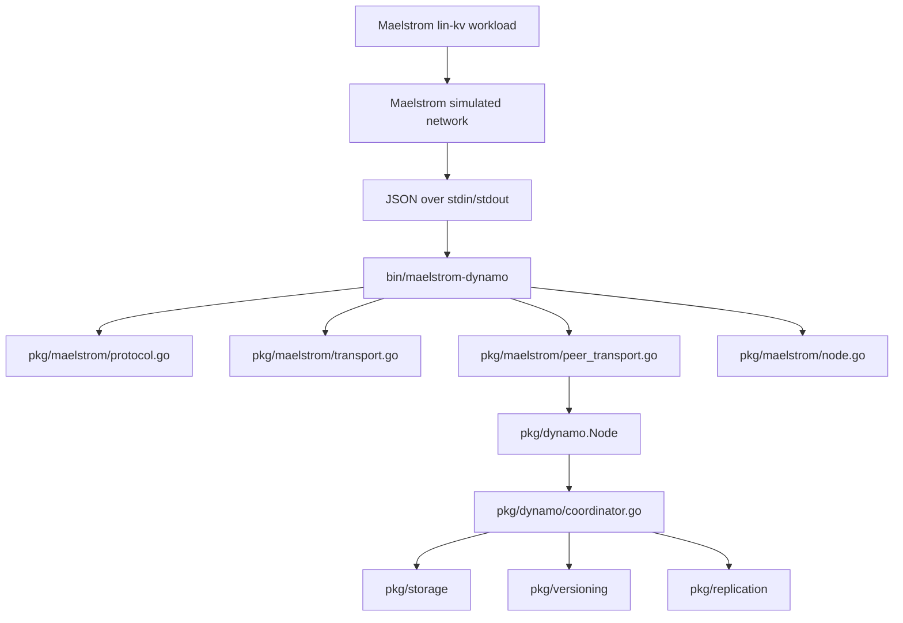

# Toy Dynamo: Distributed Key-Value Store

Toy Dynamo is a Go implementation of the core ideas from Amazon's
[Dynamo paper](https://www.allthingsdistributed.com/files/amazon-dynamo-sosp2007.pdf).
It is intentionally small enough to study, but includes real implementations of
the main distributed-systems mechanisms: consistent hashing, quorum reads and
writes, vector clocks, hinted handoff, read repair, gossip membership,
anti-entropy, and verification tooling.

This is an educational system, not a production database.

## What is implemented

- Consistent hashing ring with virtual nodes
- Configurable replication factor `N`
- Tunable read/write quorums `R` and `W`
- Vector-clock versioning and conflict preservation
- Application-level conflict reconciliation
- Hinted handoff for temporarily unavailable replicas
- Read repair on quorum reads
- Merkle-tree anti-entropy
- Gossip-based membership and failure detection
- HTTP-based inter-node transport for local clusters
- Pluggable transport boundary used by the Maelstrom adapter
- In-memory storage and a custom log-structured storage engine
- Prometheus-compatible metrics endpoint
- Admission control for throttling background work under foreground load
- Latency-aware coordinator selection
- Maelstrom correctness workloads
- Focused TLA+ models for core protocol invariants

## Architecture



The production-style local runtime uses HTTP RPC for node-to-node messages.
The Maelstrom runtime uses the same core coordinator, ring, versioning,
replication, and storage code, but swaps the inter-node transport for
Maelstrom's JSON-over-STDIO network.

## Write and read flow



With `R + W > N`, read and write quorums overlap. Toy Dynamo still exposes
Dynamo-style semantics: concurrent writes can produce multiple visible versions,
and the application is responsible for semantic reconciliation.

## Installation

Use the module directly from Go:

```sh
go get github.com/tripab/toy-dynamo
```

The public package is `github.com/tripab/toy-dynamo/pkg/dynamo`.

## Quick start

```go
package main

import (
    "context"
    "fmt"
    "log"

    "github.com/tripab/toy-dynamo/pkg/dynamo"
)

func main() {
    config := dynamo.DefaultConfig()
    config.N = 1
    config.R = 1
    config.W = 1

    node, err := dynamo.NewNode("node1", "localhost:8001", config)
    if err != nil {
        log.Fatal(err)
    }
    defer node.Stop()

    if err := node.Start(); err != nil {
        log.Fatal(err)
    }

    ctx := context.Background()

    if err := node.Put(ctx, "user:123", []byte("Alice"), nil); err != nil {
        log.Fatal(err)
    }

    result, err := node.Get(ctx, "user:123")
    if err != nil {
        log.Fatal(err)
    }

    fmt.Printf("Value: %s\n", result.Values[0].Data)

    if err := node.Put(ctx, "user:123", []byte("Alice Smith"), result.Context); err != nil {
        log.Fatal(err)
    }
}
```

More complete examples are in:

- `examples/simple`
- `examples/cluster`
- `examples/shopping_cart`

## Configuration

Start with `dynamo.DefaultConfig()` and override only the values relevant to a
test or experiment.

```go
config := dynamo.DefaultConfig()
config.N = 3
config.R = 2
config.W = 2
config.VirtualNodes = 256
config.StorageEngine = "memory"
```

Key settings:

| Setting | Purpose |
|---|---|
| `N` | Replication factor for each key. |
| `R` | Number of replica responses required for a read. |
| `W` | Number of replica acknowledgements required for a write. |
| `VirtualNodes` | Number of ring tokens per physical node. |
| `StorageEngine` | `"memory"`, `"lss"`, `"boltdb"`, or `"badger"`. |
| `StoragePath` | Base path for persistent engines. |
| `RequestTimeout` | Timeout for client-facing and peer requests. |
| `ReadRepairEnabled` | Enables asynchronous repair after reads. |
| `HintedHandoffEnabled` | Enables storing writes for temporarily unavailable replicas. |
| `AntiEntropyInterval` | Interval for Merkle-tree synchronization rounds. |
| `MetricsEnabled` | Enables Prometheus-format metrics on the HTTP server. |
| `Transport` | Optional custom inter-node transport. |
| `DisableHTTPServer` | Lets alternate runtimes, such as Maelstrom, own inbound routing. |

Common quorum configurations:

| Goal | Example | Notes |
|---|---|---|
| Balanced quorum | `N=3, R=2, W=2` | Read and write quorums intersect. |
| Fast reads | `N=3, R=1, W=3` | Reads are cheap; writes require all replicas. |
| Fast writes | `N=3, R=3, W=1` | Writes are cheap; reads require all replicas. |
| Highest availability | `N=3, R=1, W=1` | No quorum intersection; stale reads are possible. |

## Public API

```go
func NewNode(id, address string, config *Config) (*Node, error)

func (n *Node) Start() error
func (n *Node) Stop() error
func (n *Node) Join(seeds []string) error

func (n *Node) Put(ctx context.Context, key string, value []byte, context *Context) error
func (n *Node) Get(ctx context.Context, key string) (*GetResult, error)
func (n *Node) Delete(ctx context.Context, key string, context *Context) error
```

`Get` returns all non-dominated versions plus a merged context. Pass that
context back to `Put` after reconciling conflicts so the new write causally
dominates the versions it resolved.

```go
type GetResult struct {
    Values  []versioning.VersionedValue
    Context *Context
}
```

## Storage engines

Toy Dynamo supports the storage interface in `pkg/storage`.

| Engine | Status |
|---|---|
| `memory` | Default in-memory engine used by tests and examples. |
| `lss` | Custom log-structured storage engine with segment files, indexing, recovery, and compaction. |
| `boltdb` | Stub compatibility implementation; it does not persist data. |
| `badger` | Stub compatibility implementation; it does not persist data. |

Use `lss` for persistence experiments:

```go
config := dynamo.DefaultConfig()
config.StorageEngine = "lss"
config.StoragePath = "./data"
```

## Verification and testing



Run the maintained Go packages:

```sh
go test ./pkg/... ./cmd/... ./tests/unit/...
```

Run local integration tests:

```sh
go test ./tests/integration/...
```

Run benchmarks:

```sh
go test -bench=. ./tests/performance/...
```

Run Maelstrom profiles:

```sh
make maelstrom-test-quick   # smoke test
make maelstrom-test         # all predefined scenarios
make maelstrom-test-stress  # longer convergence scenario
```

Run the bounded TLA+ model checks:

```sh
make tla-check
```

See [TESTING.md](TESTING.md) for prerequisites, CI behavior, Maelstrom result
interpretation, and workflow details. [MAELSTROM_GUIDE.md](MAELSTROM_GUIDE.md)
is a compact command reference. The TLA+ specs are documented in
[specs/tla/README.md](specs/tla/README.md).

## Maelstrom adapter

The Maelstrom adapter builds as `bin/maelstrom-dynamo` from
`cmd/maelstrom/main.go`.



The required CI profile runs deterministic smoke, three-node quorum, and
partition scenarios. Latency stress scenarios such as `lossy-3` remain
available locally, but are intentionally not required CI gates because the
strict `lin-kv` checker can find real counterexamples under those conditions.

## Project layout

```text
.
├── cmd/maelstrom/              # Maelstrom adapter binary
├── examples/                   # Simple, cluster, and shopping cart examples
├── pkg/
│   ├── dynamo/                 # Node, API, coordinator, config
│   ├── maelstrom/              # JSON/STDIO adapter and peer transport
│   ├── membership/             # Gossip and failure detection
│   ├── metrics/                # Prometheus-compatible metrics
│   ├── peer/                   # Transport-backed peer client
│   ├── replication/            # Replication and hinted handoff
│   ├── ring/                   # Consistent hashing and virtual nodes
│   ├── rpc/                    # HTTP RPC server/client, retry, circuit breaker
│   ├── storage/                # Memory, LSS, and stub persistent engines
│   ├── synchronization/        # Merkle trees and anti-entropy
│   ├── transport/              # Inter-node transport interface
│   ├── types/                  # Shared interfaces
│   └── versioning/             # Vector clocks and reconciliation
├── specs/tla/                  # TLA+ models and TLC configs
├── tests/
│   ├── integration/            # Multi-node behavior tests
│   ├── maelstrom-tests/        # Maelstrom runner profiles
│   ├── performance/            # Benchmarks
│   └── unit/                   # Unit tests
├── ARCHITECTURE.md             # Detailed design notes
├── TESTING.md                  # Test and verification guide
├── MAELSTROM_GUIDE.md          # Compact Maelstrom command guide
└── Makefile                    # Local verification targets
```

## Current limitations

- The system is for learning and experimentation, not production deployment.
- Dynamo-style conflict resolution is application-defined.
- `memory` is the default storage engine; `lss` is the meaningful persistence
  implementation. `boltdb` and `badger` are stubs.
- Integration tests use fixed local ports; run one copy of the integration
  package at a time.
- Maelstrom tests validate selected properties of the real code, but they do
  not prove correctness.
- TLA+ specs verify small bounded protocol models, not the Go implementation.

## References

- [Dynamo: Amazon's Highly Available Key-value Store](https://www.allthingsdistributed.com/files/amazon-dynamo-sosp2007.pdf)
- [Consistent Hashing and Random Trees](https://dl.acm.org/doi/10.1145/258533.258660)
- [Time, Clocks, and the Ordering of Events](https://lamport.azurewebsites.net/pubs/time-clocks.pdf)
- [Maelstrom](https://github.com/jepsen-io/maelstrom)
- [TLA+](https://lamport.azurewebsites.net/tla/tla.html)
